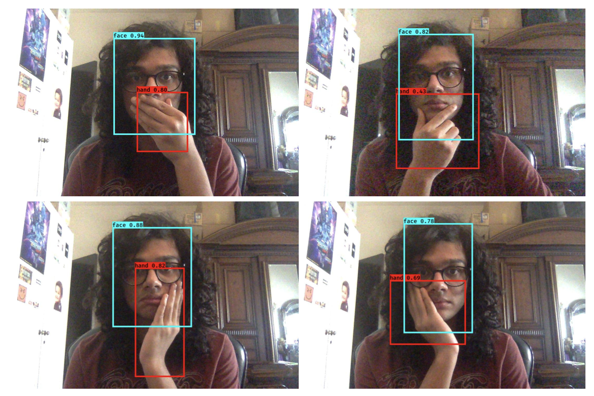

# STYF-Stop-Touching-Your-Face
A real-time YOLOv3 object detection model for detecting face touches. \
Here is a video, showing our final results from a live webcam feed: [link to video](https://iiitaphyd-my.sharepoint.com/:v:/g/personal/abhinav_g_students_iiit_ac_in/EZSQn2CeNehBm47Gf414KpcBSUL7t70YMea6iVi9rydnIA?e=PmfI8M)

Done as an independent project in Spring 2020.

### Abstract
The World Health Organisation (WHO) proposes many preventive techniques to stay safe from the ongoing coron- avirus pandemic, especially to avoid touching our faces in order to decrease the probability of contracting the virus. However, touching one’s face is a very involuntary and ha- bitual action. We propose a ’Stop Touching Your Face’ YOLOv3 object detection model trained on a custom dataset of ’Face-Hands’ images that would detect a hand touching the face in real time and alert the user about the imminent danger.

### The Basic Pipeline:
- We first curated a custom 'Face-Hands' dataset, comprising of around 140 images - with and without my hand touching it. Data augmentation was performed as well, by randomising the brightness of the images. 

- We apply transfer learning and fine-tune a YOLOv3 model for this dataset, using the pre-trained weights from ImageNet. We only predict those bounding boxes with the highest confidence scores to avoid multiple detections. 
- We then check for any overlap between the 'face' and 'hand' bounding boxes and if it's present, we play a sound file that screams 'stop touching your face!'.
- And since YOLOv3 is real-time, our python script captures images from the webcam's live feed and we feed it to our model for inference! 
The network is thus able to successfully detect if the user touches his or her face through a live camera feed, and shoots a warning at the user!  
